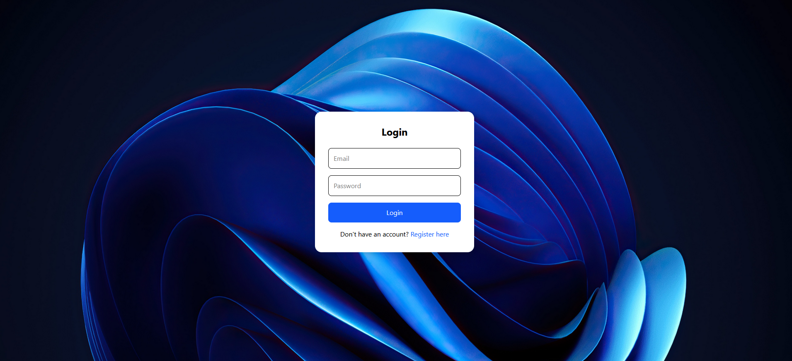
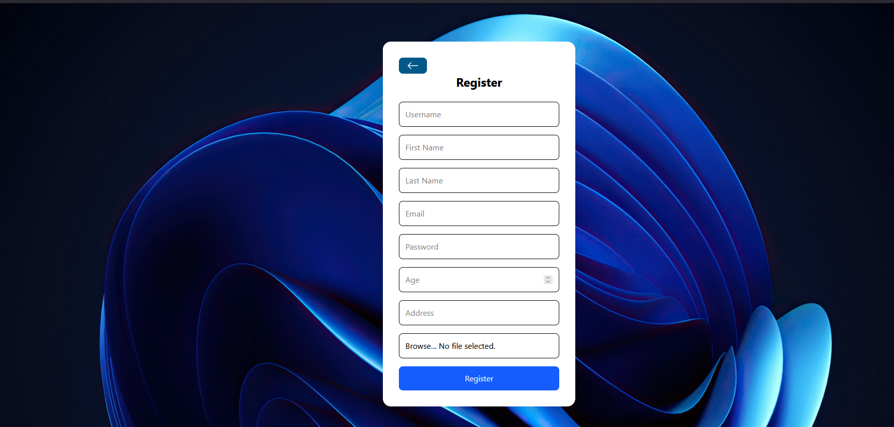
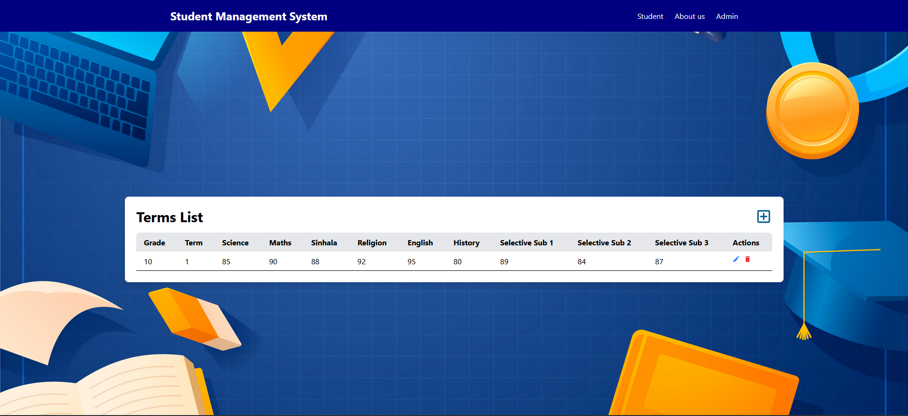
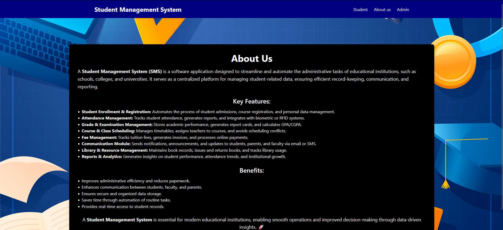
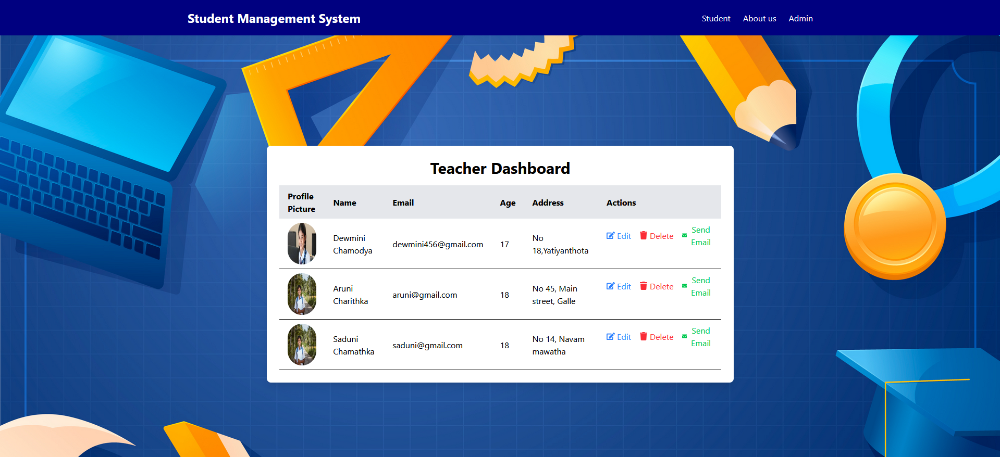

# Student-Teacher Management System








## Project Overview

This is a Student-Teacher Management System designed to streamline and manage student-teacher interactions, registrations, and course information in an academic environment. The system allows teachers to manage students' data, assign courses, and track performance, while students can register for courses and view their academic progress.

## Features

- Teacher Registration and Login
- Student Registration and Login
- Course Management (Create, Assign, Update)
- Student Enrollment for Courses
- Track Grades and Performance
- Manage Timetable for Teachers and Students
- User-friendly interface with role-based access (Admin, Teacher, Student)

## Tools and Technologies Used

- **Frontend:**
  - React.js: For building the user interface.
  - React Router: For navigation between pages.
  - React Hooks: For state management and component lifecycle.
  - Tailwind CSS: For styling the user interface with utility-first CSS.
  - React Icons: For incorporating customizable icons.

- **Backend:**
  - Node.js: For building the backend server.
  - Express.js: For handling HTTP requests and API routing.
  - MongoDB: For database management, storing student, teacher, and course data.
  - Mongoose: For MongoDB object modeling and managing database queries.
  - JWT (JSON Web Token): For user authentication and session management.

- **Other Tools:**
  - Git: For version control and managing project history.
  - Postman: For testing API endpoints and requests.
  - Heroku: For hosting the backend (if deployed).
  - VS Code: For development and code editing.

## Installation

To set up the project locally, follow these steps:

### Prerequisites

- Node.js (version 14 or higher)
- MongoDB (locally installed or MongoDB Atlas for cloud-based database)

### Steps to Install

1. Clone the repository to your local machine:
   ```bash
   git clone https://github.com/your-username/student-teacher-management.git
